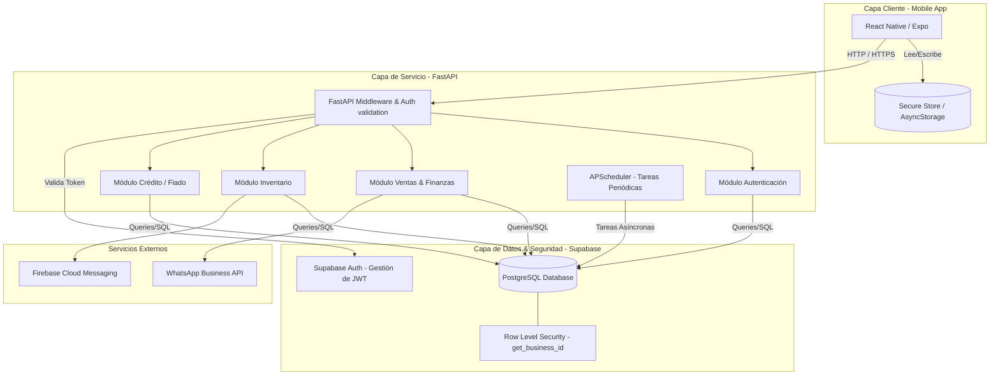

# Arquitectura del Sistema - CuentaClara

Este documento describe la arquitectura técnica, los componentes clave y las decisiones de diseño del sistema CuentaClara.

---

## 🏗️ Estructura General

CuentaClara está diseñado como un **Monolito Modular Centralizado**, priorizando la velocidad de desarrollo de un Producto Mínimo Viable (MVP) escalable sin introducir la complejidad operativa de microservicios.



---

## 🔒 Patrón de Aislamiento Multi-tenant (Tenancy)

El sistema utiliza una base de datos única y compartida, pero garantiza el aislamiento estricto de datos mediante **Row Level Security (RLS)** en PostgreSQL.

1. **Autenticación y Token JWT:**
   * El cliente móvil inicia sesión contra el backend de FastAPI.
   * FastAPI autentica las credenciales con Supabase Auth y recibe un token JWT.
   * El cliente móvil envía este JWT en el header `Authorization: Bearer <token>` de cada petición HTTP.

2. **Middleware y Contexto:**
   * El middleware en FastAPI extrae el token JWT y lo valida contra Supabase.
   * Se obtiene el ID del usuario (`auth.uid()`) y se consulta en la tabla `public.users` su `business_id` asociado.
   * Este contexto (`business_id`, `role`, `user_id`) se inyecta de forma segura a los routers de FastAPI.

3. **Políticas RLS en Base de Datos:**
   * Todas las tablas de negocio tienen habilitado RLS.
   * La función personalizada `get_business_id()` se evalúa en cada consulta SQL:
     ```sql
     CREATE POLICY "nombre_politica" ON public.tabla
       FOR ALL USING (business_id = get_business_id());
     ```
   * Esto asegura que ningún inquilino (Tenant) pueda ver o alterar registros de otro, incluso si hay bugs en el código del servidor.

---

## 📱 Bifurcación Adaptativa de la UI

El frontend móvil en React Native ajusta dinámicamente las pantallas, botones y flujos de navegación del usuario tras el onboarding inicial:

* **Modo Simple (Usuario Informal):**
  * Optimizado para velocidad operativa en pantallas pequeñas y sin distracciones.
  * Flujo de venta en un solo paso (Quick Sell).
  * Panel de Fiados para gestión rápida de deudas por apodo.
  * No expone opciones complejas como recetas, impuestos desglosados ni diarios contables estructurados.

* **Modo Avanzado (PYME):**
  * Presenta dashboards detallados y reportes mensuales descargables.
  * Gestión de insumos y recetas de producción.
  * Configuración de datos fiscales e impresión/envío de facturas legales con desglose de ITBMS.
  * Soporte para múltiples usuarios de staff.

---

## ⏲️ Procesamiento Asíncrono y Tareas Programadas

El backend de FastAPI utiliza dos mecanismos de procesamiento en segundo plano para evitar bloquear el hilo principal de las solicitudes HTTP:

1. **FastAPI BackgroundTasks:**
   * Se utiliza para procesos desencadenados por el usuario que tardan más de 1 segundo, como la **generación de PDFs de facturas** o el envío de alertas de stock bajo mediante la API de WhatsApp.
2. **APScheduler:**
   * Orquestador interno que corre en segundo plano en el servidor para tareas cronometradas recurrentes (ej. cálculo diario de saldos consolidados, paso de deudas vencidas a estado `overdue`, y limpieza de sesiones de caja huérfanas).
