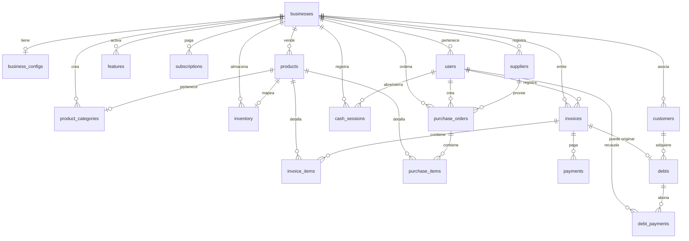

# Documentación de la Base de Datos - CuentaClara

Este documento detalla la estructura física de la base de datos de CuentaClara (Supabase PostgreSQL), incluyendo las relaciones de las tablas, índices de rendimiento y la seguridad a nivel de fila (RLS).

---

## 🗺️ Modelo de Entidad-Relación (Estructura de Tablas)

La base de datos sigue un diseño de **Inquilino Único Compartido (Multi-tenant de una sola BD)** con aislamiento lógico.



---

## 📋 Diccionario de Tablas Principales

### 1. Núcleo y Tenancy
* **`businesses`**: Tabla principal de inquilinos.
  * `id` (UUID, PK): Generado automáticamente.
  * `name` (VARCHAR): Nombre comercial.
  * `ui_mode` (VARCHAR): Modo visual (`simple` o `advanced`).
  * `plan` (VARCHAR): Plan de suscripción (`free`, `basic`, `pro`).
* **`users`**: Perfiles de usuario de los negocios (mapeados 1:1 con `auth.users`).
  * `id` (UUID, PK): Vinculado a Supabase Auth.
  * `business_id` (UUID, FK): Apunta a `businesses.id`.
  * `role` (VARCHAR): Rol (`owner`, `staff`, `admin`).
* **`features`**: Tabla que determina los módulos habilitados por negocio.
  * `business_id` (UUID, FK), `module` (VARCHAR), `is_active` (BOOLEAN).
* **`business_configs`**: Configuración personalizable por negocio (1:1 con `businesses`).
  * `business_id` (UUID, FK, UNIQUE), `currency`, `weight_unit`, `tax_rate` (DECIMAL), `logo_url`, `primary_color`, `language`, `settings` (JSONB).
* **`subscriptions`**: Historial de suscripciones/planes de pago del negocio.
  * `business_id` (UUID, FK), `plan` (`free`, `basic`, `pro`), `status` (`active`, `expired`, `cancelled`), `starts_at`, `ends_at`, `payment_ref`.
* **`users.mfa_secret` / `users.mfa_enabled`**: columnas de autenticación de dos factores (TOTP) sobre la tabla `users` (`database/schema/13_mfa.sql`).

### 2. Inventario e Insumos
* **`product_categories`**: Categorías de productos definidas por negocio.
  * `business_id` (UUID, FK), `name` (VARCHAR), `color` (VARCHAR).
* **`products`**: Productos o servicios a vender.
  * `id` (SERIAL, PK).
  * `business_id` (UUID, FK), `category_id` (INTEGER, FK a `product_categories`).
  * `name` (VARCHAR), `sku` (VARCHAR), `price` (DECIMAL).
  * `unit_type` (VARCHAR): Unidad de medida.
* **`inventory`**: Tabla que contiene los niveles de existencias actuales.
  * `product_id` (INTEGER, FK), `quantity` (DECIMAL), `min_stock` (DECIMAL).
* **`inventory_movements`**: Kardex o historial de transacciones físicas de stock.
  * `type` (`in`, `out`, `adjust`, `loss`).
  * `reason` (`sale`, `purchase`, `waste`, `manual`, `return`).

### 2.1 Compras
* **`suppliers`**: Proveedores del negocio.
  * `business_id` (UUID, FK), `name` (VARCHAR), `phone`, `email`, `tax_id`, `is_active` (BOOLEAN).
* **`purchase_orders`**: Cabecera de una orden de compra a proveedor.
  * `business_id` (UUID, FK), `supplier_id` (FK), `total` (DECIMAL), `status` (`draft`, `received`, `cancelled`), `user_id` (FK), `ordered_at`, `received_at`.
* **`purchase_items`**: Detalle de productos dentro de una orden de compra.
  * `purchase_order_id` (FK), `product_id` (FK), `quantity` (DECIMAL), `unit_cost` (DECIMAL), `subtotal` (DECIMAL).

### 3. Ventas y Facturación
* **`invoices`**: Cabecera de transacciones comerciales.
  * `total` (DECIMAL), `tax` (DECIMAL), `status` (`paid`, `pending`, `void`).
* **`invoice_items`**: Detalle de artículos dentro de una venta.
  * `invoice_id` (FK), `product_id` (FK), `quantity` (DECIMAL), `unit_price` (DECIMAL), `subtotal` (DECIMAL).
* **`payments`**: Métodos y referencias de pago asociados a una factura.
  * `method` (`cash`, `card`, `transfer`, `other`).

### 4. Crédito (Fiado)
* **`customers`**: Contactos del negocio para cobros de fiado.
  * `business_id` (UUID, FK), `name` (VARCHAR), `phone` (VARCHAR).
* **`debts`**: Registro individual de fiados abiertos.
  * `customer_id` (FK), `invoice_id` (FK, NULL si es fiado directo), `original_amount` (DECIMAL), `remaining_amount` (DECIMAL), `status` (`pending`, `partial`, `paid`, `overdue`, `cancelled`).
* **`debt_payments`**: Recibo de abonos asociados a un fiado.

---

## 🔒 Seguridad a Nivel de Fila (RLS)

El aislamiento entre negocios está reforzado por RLS. Ninguna consulta enviada por el rol `authenticated` de la aplicación móvil se ejecuta sin evaluar la directiva `get_business_id()`.

### Función Helper de Extracción:
```sql
CREATE OR REPLACE FUNCTION public.get_business_id()
RETURNS UUID AS $$
  WITH claims AS (
    SELECT NULLIF(current_setting('request.jwt.claims', true), '')::jsonb AS jwt
  )
  SELECT COALESCE(
    NULLIF((SELECT jwt ->> 'business_id' FROM claims), '')::UUID,
    (
      SELECT business_id
      FROM public.users
      WHERE id = auth.uid()
      LIMIT 1
    )
  );
$$ LANGUAGE sql STABLE SECURITY DEFINER SET search_path = public;
```

### Ejemplo de Política RLS:
```sql
ALTER TABLE public.products ENABLE ROW LEVEL SECURITY;

CREATE POLICY "productos del negocio" ON public.products
  FOR ALL USING (business_id = get_business_id());
```

---

## ⚡ Índices de Rendimiento Críticos

Para garantizar tiempos de respuesta menores a 200ms en el cliente móvil, todas las tablas grandes tienen índices compuestos por `business_id`:

```sql
-- Índices para el módulo de inventario
CREATE INDEX idx_products_business ON products(business_id, is_active);
CREATE INDEX idx_inventory_product ON inventory(product_id);

-- Índices para ventas e informes
CREATE INDEX idx_invoices_business_date ON invoices(business_id, created_at DESC);
CREATE INDEX idx_invoice_items_invoice ON invoice_items(invoice_id);

-- Índices para fiados y abonos
CREATE INDEX idx_customers_business_name ON customers(business_id, name);
CREATE INDEX idx_debts_business_status ON debts(business_id, status);
CREATE INDEX idx_debt_payments_debt ON debt_payments(debt_id);
```
